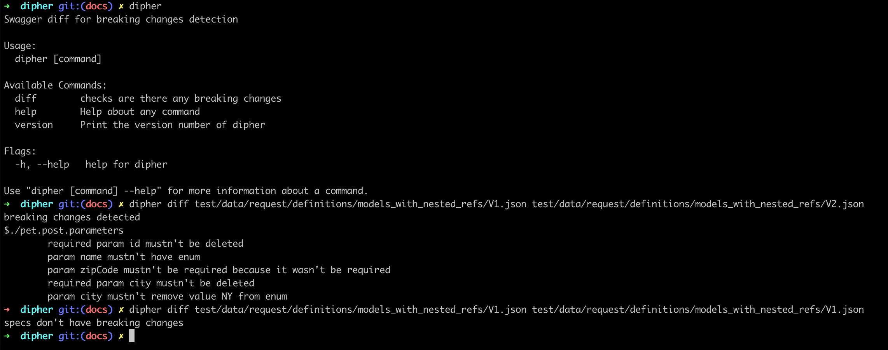

[](https://travis-ci.com/vadim-hleif/dipher)
[](https://goreportcard.com/report/github.com/vadim-hleif/dipher)
[](https://codecov.io/gh/vadim-hleif/dipher)
[](https://codebeat.co/projects/github-com-vadim-hleif-dipher-master)

[](http://godoc.org/github.com/vadim-hleif/dipher/pkg)

## What is Dipher?
It's a tool for founding breaking changes between old and new swaggers spec versions. Now it supports only [Swagger 2.0](https://swagger.io/specification/v2/).

It could be useful for REST services as additional check in CI/CD pipelines. 

## Why Dipher?

Analogues with swagger diff functionality don't handle such many cases as current library - e.g. enums changes, nested object changes.

## Installation
* Chose required release [here](https://github.com/vadim-hleif/dipher/releases/latest): 
   * e.g. [v0.1.1 darwin amd86](https://github.com/vadim-hleif/dipher/releases/download/v0.1.1/dipher_0.1.1_darwin_amd64.tar.gz)
* Download archive and extract binary:
    ```shell script
    wget https://github.com/vadim-hleif/dipher/releases/download/v0.1.1/dipher_0.1.1_darwin_amd64.tar.gz
    tar -zxvf dipher_0.1.1_darwin_amd64.tar.gz dipher
    rm dipher_0.1.1_darwin_amd64.tar.gz && mv dipher /usr/local/bin
    ```
* Maybe will be added some package managers - now only manual installation is available
## Usage


## Current features list
***
- [X] all path and verb combinations in the old specification are present in the new one
- [X] no request parameters are required in the new specification that were not required in the old one
- [X] all required request parameters in the old specification are present in the new one
- [X] all request parameters in the old specification have the same type in the new one
- [X] all request models via $ref don't have any differences
- [X] all response attributes in the old specification are present in the new one
- [X] all response attributes in the old specification have the same type in the new one
- [X] all response models via $ref don't have any differences
- [X] enums validation
- [X] arrays type support
- [X] recursive refs
- [ ] extensions validation


## TODO minor features list
- [ ] common / global parameters (in root of some path / specification)
- [ ] empty value parameters
- [X] ref to not definitions node
- [X] recursive objects
- [ ] reusable enums
- [ ] array of anonymous objects
- [ ] definition in V1 with object in V2 (both cases)
- [ ] reusing responses https://swagger.io/docs/specification/2-0/describing-responses/